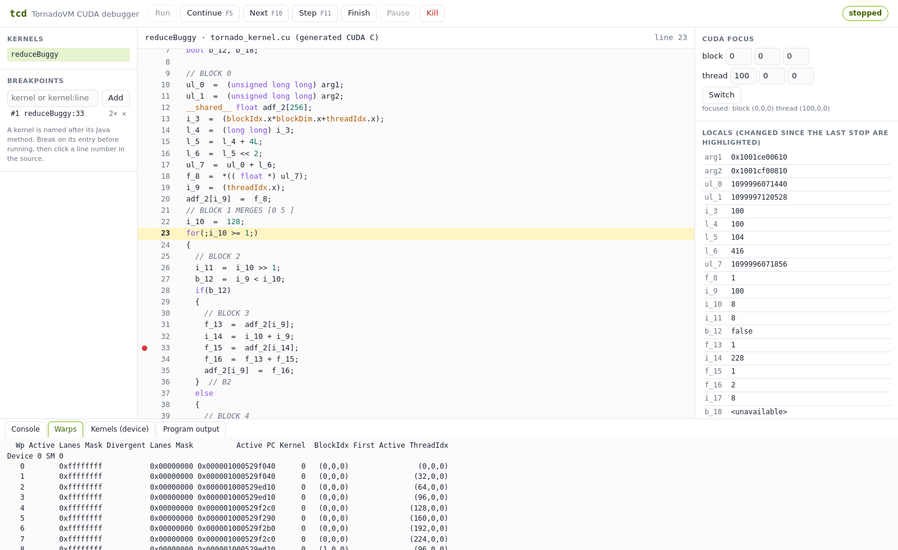

<p align="center"></p>

Breakpoints, per-thread inspection and sanitizers for the CUDA kernels that
[TornadoVM](https://github.com/beehive-lab/TornadoVM) generates from your Java code. It uses
cuda-gdb and compute-sanitizer underneath, and works with unmodified TornadoVM SDKs that have the CUDA backend.



## Quick start

```bash
export TORNADOVM_HOME=~/.sdkman/candidates/tornadovm/7.0.1-jdk21-cuda
bin/tcd doctor                                                     # check the setup
bin/tcd memcheck --tool racecheck -- -cp classes my.Main           # find the bug
bin/tcd batch -b myKernel:33 --at 0:100 -- -cp classes my.Main     # inspect a thread
bin/tcd ui -b myKernel -- -cp classes my.Main                      # web debugger
```

Put your normal `java` arguments after `--`; tcd adds the TornadoVM flags itself. A kernel is
named after its Java method. Lines are lines of the generated CUDA C. `--at B:T` selects a block and thread
(`2:5` for 1-D, `2,0,0:5,1,0` for 3-D). `bin/tcd` runs `tcd.java` with JBang, or with `java` (JDK 21+).

| command | |
|---|---|
| `doctor` | checks cuda-gdb, the driver, the SDK and permissions |
| `run` | interactive cuda-gdb, set up for the JVM (`--tui` for the TUI) |
| `batch` | runs to a breakpoint and prints locals, `__shared__` and `-p` expressions per thread (`--json`) |
| `memcheck` | compute-sanitizer (`--tool memcheck\|racecheck\|initcheck\|synccheck`), with reports mapped to generated lines and grouped |
| `ui` | web debugger on `127.0.0.1:7777`: breakpoints, F5/F10/F11, thread focus, locals, shared memory, arrays, warps |

Inside cuda-gdb: `tcd-break K[:L]`, `tcd-list`, `tcd-array arg1 float 0 16`, `tcd-shared adf_2 float`.

## Use it on your own TornadoVM kernel

Given a task in your code, for example:

```java
public static void vectorAdd(KernelContext ctx, FloatArray a, FloatArray b, FloatArray c) {
    int i = ctx.globalIdx;
    c.set(i, a.get(i) + b.get(i));
}
...
new TaskGraph("s0").task("t0", MyApp::vectorAdd, ctx, a, b, c) ...
```

1. **Build your app as usual**, whether with Maven, Gradle or `javac`. Nothing in your code changes, and the tornado jars come from the SDK.
2. **The kernel name is the Java method name:** `vectorAdd`. Arguments that are not a `KernelContext` become
   `arg1`, `arg2`, … in the generated code.
3. **Check for memory errors and races across the whole grid:**
   ```bash
   bin/tcd memcheck -- -cp target/classes com.acme.MyApp               # out-of-bounds, bad addresses
   bin/tcd memcheck --tool racecheck -- -cp target/classes com.acme.MyApp  # shared-memory races
   ```
   Every report names a generated line (`>> vectorAdd:17  ...`) and the source file for it.
4. **Stop at the kernel entry to see the generated CUDA C and its line numbers:**
   ```bash
   bin/tcd run -b vectorAdd -- -cp target/classes com.acme.MyApp
   (cuda-gdb) tcd-list                          # generated source, current line marked
   (cuda-gdb) cuda block (3,0,0) thread (7,0,0) # focus on any GPU thread
   (cuda-gdb) next                              # step
   (cuda-gdb) info locals                       # i_3 is ctx.globalIdx, f_8 is a.get(i), ...
   (cuda-gdb) tcd-array arg1 float 0 8          # contents of FloatArray a
   ```
5. **Script it, or hand it to an agent:** `bin/tcd batch -b vectorAdd:17 --at 3:7 --json -- -cp target/classes com.acme.MyApp`.
   Or use `bin/tcd ui …` and click line numbers to set breakpoints.

Use a small problem size, because debug builds (`-G`) are slow. Application arguments go after the main
class, as usual. `@Parallel` loop kernels work the same way (the generated code is a grid-stride loop).

**Examples:** a missing barrier and a silent out-of-bounds write, each found and fixed step
by step. See [docs/examples.md](docs/examples.md).

## How it works

- Kernels are compiled with `-G -lineinfo` through `tornado.cuda.compiler.flags`, with the cubin cache disabled.
- The generated sources are dumped, and each device stop maps `tornado_kernel.cu` (the name NVRTC gives every kernel) to the right kernel.
- `gdb/tornado.gdbinit` passes through the signals HotSpot uses internally, and `tcd-break` only ever fires in device code.
- `tcd ui` drives `cuda-gdb --interpreter=mi3` behind the JDK's HTTP server. There are no dependencies beyond a JDK.

## Claude Code skill

```bash
mkdir -p ~/.claude/skills/tornadovm-cuda-debug && cp skill/SKILL.md ~/.claude/skills/tornadovm-cuda-debug/
```

Tested with cuda-gdb 12.6, TornadoVM 7.0.1 (JDK 21) and an RTX 4090. Apache 2.0.
